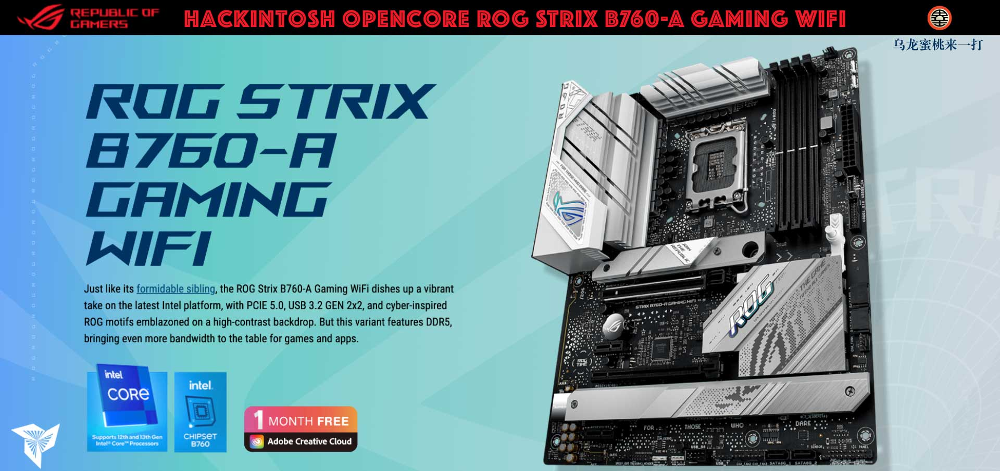

## ROG STRIX B760-A GAMING WiFi Hackintosh OpenCore EFI



### [English](https://github.com/hackintosh-club/ROG-B760-A-GAMING-WIFI-OpenCore)

### OpenCore

[OpenCore 1.0.0](https://github.com/acidanthera/OpenCorePkg)

### 支持的系统版本

- macOS Monterey 12.x
- macOS Ventura    13.x
- macOS Sonoma   14.x 

### 硬件

- 主板: Asus ROG Strix B760-A Gaming WiFi
- Bios版本: 1641（2024/02/20）
- CPU: Intel i7-13700KF
- 内存: G.SKILL 32GB*2 DDR5 6400MHz
- 固态硬盘: 1.致钛 Ti600 1TB MacOS
- 固态硬盘: 2.金士顿 SKC3000D 2048G Windows
- 独显: 华硕 AMD Radeon RX6600XT 8GB
- 网卡: Intel L226-V
- 无线网卡: Intel Wi-Fi 6E AX211 160MHz

### 注意事项

 - 安装成功后必须使用 [OCAuxiliaryTools](https://github.com/ic005k/OCAuxiliaryTools) 生成你自己的 SMBIOS
 - 如需使用没有小核心的CPU，必须取消勾选配置文件中Kernel--ProvideCurrentCpuinfo选项
 - 此EFI中的英特尔无线网卡驱动[AirportItlwm.kext](https://github.com/OpenIntelWireless/itlwm/releases)仅适用于 MacOS 14.4 - 14.5 Sonoma,安装其它版本请自行下载替换此驱动

### Bios Setup

```
dvanced

  |-- UEFI Variables Protection
     |-- password protection of Runtime Variables ：Disabled
     
  |-- System Agent(SA)Configuration
     |-- VT-D ：Enabled
     |-- Control Iommu Pre-boot Behavior ：Disable IOMMU
	   
  |--PCI Subsystem Settings
     |-- Above 4G Decoding ：Enabled
     |-- Resize BAR Support ：Disabled
     |-- SR-IOV Support ：Disabled
   
Boot

  |-- Secure Boot
    |-- OS Type ：Other OS
    |-- Secure Boot Mode ：Custom
      
  |-- Boot Configuration
    |-- Fast Boot ：Disabled
      
  |-- CSM (Compatibility Support Module)
    |-- Launch CSM  ：Disabled
	
```

### 参考内容

[1.黑苹果安装过程演示](https://hackintosh.club/d/10000060)

[2.英特尔无线网卡WiFi驱动](https://hackintosh.club/d/10000015)

[3.英特尔无线网卡蓝牙驱动](https://hackintosh.club/d/10000017)

[4.我的B站黑苹果教程](https://space.bilibili.com/244390800/video)

[6.黑果之家](https://hackintosh.club)

### 联系我们

 - QQ群: 23304408

